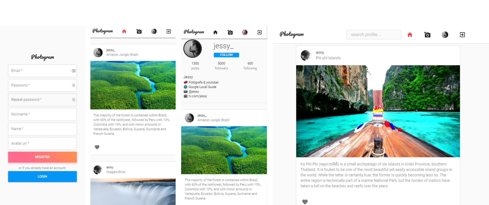

<h1 align="center" style="font-family: Pacifico, cursive">
    Photogram
      <a href="https://github.com/furttado/react-photogram"></a> 
</h1>


## 📢 About

> **Photogram** is a web application, developed with **React**, inspired by the interface and features of Instagram.

The project is under development and aims to help me practice and consolidate the concepts of web development.


## 🚀 Live Demo
* http://bit.ly/photogram-v1-1
* https://bit.ly/photogram-v1


## ⚡ Tools

* ReactJS
* HTML
* CSS
* JavaScript
* React Router
* React Hooks
* uuid
* Material UI


## 📌 Goals

* **Pages**

  * Register ✅
  * Login ✅
  * Landing (feed) ✅
  * Profile ✅
    * edit profile ⚠️
    * grid view ⚠️
    * list followers ⚠️
    * list following ⚠️
  * New Post  ✅
    * preview functionality ✔

* **Components**

  * Header (toolbar)
  * PostItem
    * comment field ⚠️
    * show comments ⚠️

  

* **Layout**

  * Global style ✅

  * Responsive layout ✅

    * turn Header search bar avaiable for mobile ⚠️

    

* **Routes** ✅

  * Active page and route (global state) ✅


## ⬇️ Clone this project

> **REQUIRED**: You will need **Yarn**(or NPM) 

```bash
# Clone this repository
$ git clone https://github.com/furttado/react-photogram.git
```

### Run  the local server

```bash
# Navigate go to project folder
$ cd react-photogram

# Install dependencies => only once
$ yarn install

# Run the local server
$ yarn start
```

